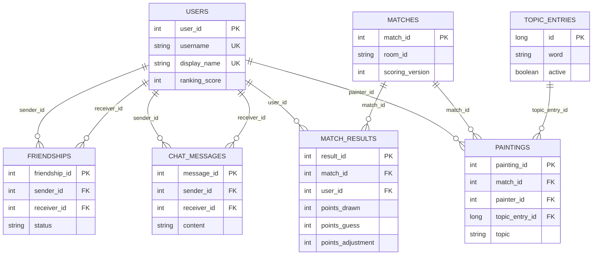

# ERD từ bảng MySQL và entity

```mermaid
erDiagram
    USERS ||--o{ FRIENDSHIPS : sender_id
    USERS ||--o{ FRIENDSHIPS : receiver_id
    USERS ||--o{ CHAT_MESSAGES : sender_id
    USERS ||--o{ CHAT_MESSAGES : receiver_id
    USERS ||--o{ MATCH_RESULTS : user_id
    MATCHES ||--o{ MATCH_RESULTS : match_id
    USERS ||--o{ PAINTINGS : painter_id
    MATCHES ||--o{ PAINTINGS : match_id
    TOPIC_ENTRIES ||--o{ PAINTINGS : topic_entry_id
    USERS { int user_id PK
        string username UK
        string display_name UK
        int ranking_score
    }
    FRIENDSHIPS { int friendship_id PK
        int sender_id FK
        int receiver_id FK
        string status
    }
    CHAT_MESSAGES { int message_id PK
        int sender_id FK
        int receiver_id FK
        string content
    }
    MATCHES { int match_id PK
        string room_id
        int scoring_version
    }
    MATCH_RESULTS { int result_id PK
        int match_id FK
        int user_id FK
        int points_drawn
        int points_guess
        int points_adjustment
    }
    PAINTINGS { int painting_id PK
        int match_id FK
        int painter_id FK
        long topic_entry_id FK
        string topic
    }
    TOPIC_ENTRIES { long id PK
        string word
        boolean active
    }
```

Không vẽ rooms/sessions/guesses như bảng SQL vì hiện không tồn tại. Quan hệ `MATCH_RESULTS` là bảng liên kết người chơi và trận có thuộc tính điểm.
